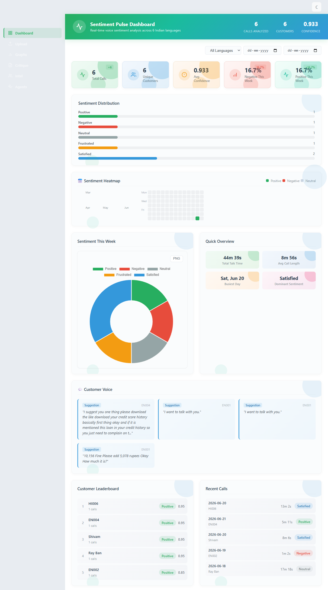
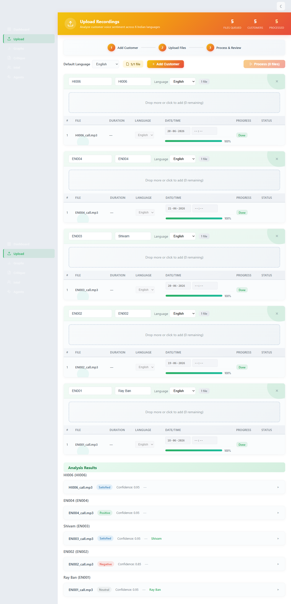
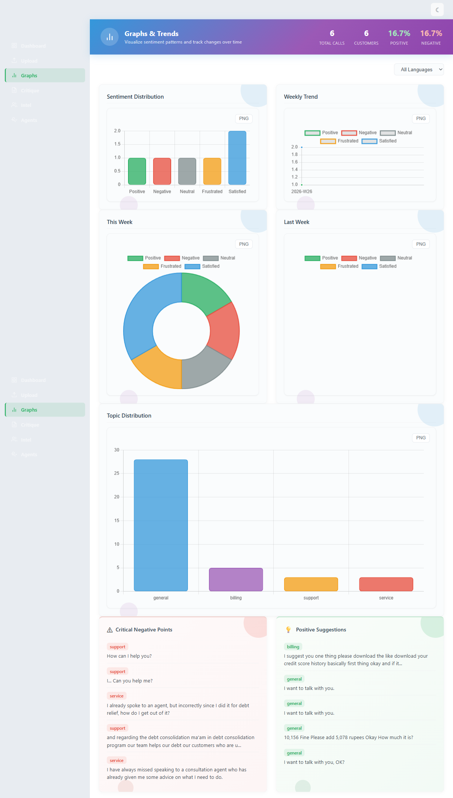
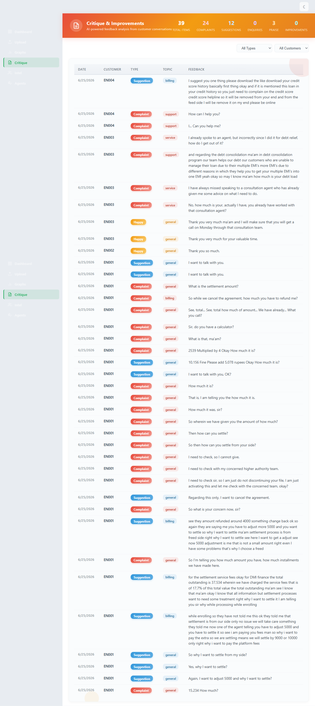
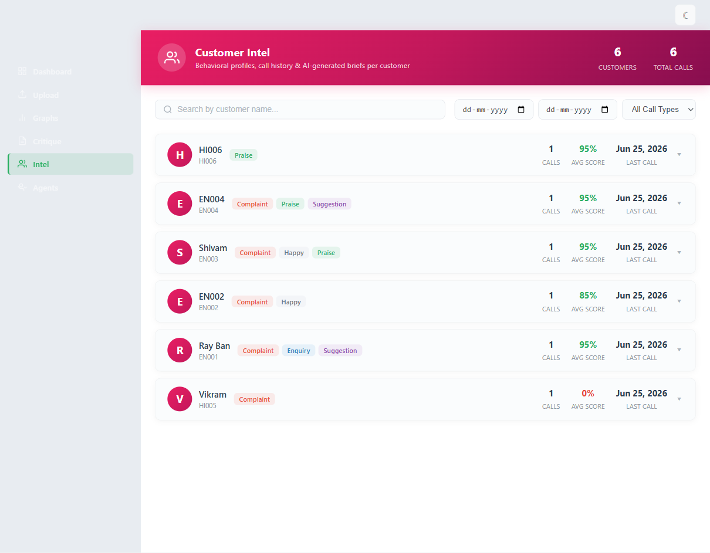
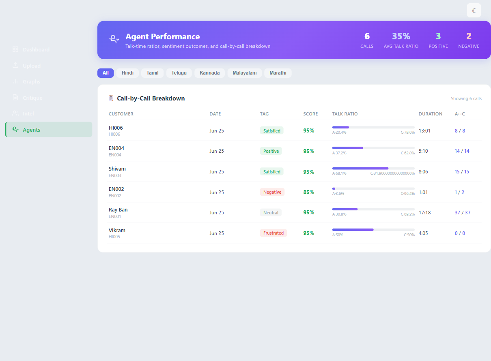

# 💓 Sentiment Pulse Analyzer

**Real-time multilingual voice sentiment analysis — from raw customer calls to actionable emotional intelligence.**

Ever wondered what your customers are *really* feeling during a support call? Not just what they say, but the emotional texture underneath? That's what Sentiment Pulse Analyzer does. Upload a call recording — in any of 5+ Indian languages — and within minutes, you get a full breakdown: who spoke, what they felt, whether the emotion shifted mid-call, and even a curated summary for your agents.

It's like having a hyper-observant quality analyst who listens to every call and never gets tired.

---

## 🎯 The Five Sentiment Categories

We don't settle for just "positive" vs "negative." Real conversations are more nuanced. Every call gets tagged into one of five fine-grained emotional categories:

| Tag | What It Means | Example |
|---|---|---|
| **Positive** 😊 | The customer is genuinely happy, thankful, or pleasantly surprised | *"Thank you so much, this was really helpful!"* |
| **Satisfied** ✅ | The customer is content — their issue was resolved, they feel heard. More subtle than happy | *"Okay, that works. Thanks for sorting it out."* |
| **Neutral** 😐 | Purely factual or transactional. No strong emotional charge | *"What's my account balance?"* |
| **Negative** 😕 | Mild disappointment or dissatisfaction — but NOT anger | *"I expected better... this is disappointing."* |
| **Frustrated** 😤 | The customer is actively angry, irritated, or venting. This is the strongest negative signal | *"I've been waiting for TWO hours, this is ridiculous!"* |

> **Why five?** Because lumping "mildly unhappy" and "furious" into the same bucket buries critical red flags. And calling someone "positive" when they're just *relieved* misses the real story. We designed this taxonomy to surface what actually matters.

---

## 🧠 How It Works (The Pipeline)

Every uploaded audio file goes through a carefully orchestrated five-stage pipeline:

```
🎙️ Audio Upload → 🔤 Transcription → 👥 Diarization → 💡 Sentiment Classification → 📊 Results + Critique
```

### Step 1 — Transcription (WhisperX)
We use **WhisperX** (the `large-v2` model) to convert speech to timestamped text. It handles English, Hindi, Tamil, Telugu, and several other Indian languages with strong accuracy. WhisperX also handles language detection automatically, so you don't need to manually tag each file.

### Step 2 — Speaker Diarization (Pyannote)
**Pyannote Audio 3.1** splits the transcript by speaker. Who is the customer? Who is the agent? Pyannote analyzes the acoustic signal to identify *who said what*, giving us a clean, speaker-labeled transcript. This is VRAM-heavy, so our pipeline smartly offloads WhisperX to CPU before running diarization on GPU — squeezing everything onto a single GPU card.

### Step 3 — Sentiment Classification (Groq + DeBERTa-v3)
Here's where the magic happens. We run a **two-tier classification**:

- **Primary Engine — Groq (LLaMA 3.1 8B Instant)**: The transcript is sent to Groq's ultra-fast inference API with a carefully engineered prompt that distinguishes between all five labels. Groq's LLM picks up on context, phrasing, and emotional subtext that keyword-based classifiers miss.
- **Fallback Engine — Local DeBERTa-v3**: If Groq is unavailable (rate limit, network issue), we seamlessly fall back to a zero-shot DeBERTa-v3 model running locally on GPU, using 3 labels (Positive / Negative / Neutral) for higher per-label confidence.

The result? Every call gets a **confidence score from 0 to 1.0** — and with Groq, we consistently hit **0.85–0.99**.

### Step 4 — Critique Extraction
We also run a regex-based NLP layer that extracts actionable feedback from the transcript: complaints, suggestions, enquiries, expressions of disappointment, happy remarks, and concrete improvement ideas. These appear in the Critique tab.

### Step 5 — Agent Briefing
Using Groq again (or falling back gracefully), we generate a short **Approach Brief** for customer service agents — what tone to use, what topics to avoid, and the key pain point to address first.

---

## 🚀 Technologies We Used

### Core ML / AI
| Tool | Role | Link |
|---|---|---|
| **WhisperX** | Speech-to-text transcription + word-level alignment | [GitHub](https://github.com/m-bain/whisperX) · [HuggingFace](https://huggingface.co/m-bain) |
| **Pyannote Audio** | Speaker diarization (who spoke when) | [GitHub](https://github.com/pyannote/pyannote-audio) · [HuggingFace](https://huggingface.co/pyannote) |
| **Groq (LLaMA 3.1 8B)** | Primary sentiment classifier + agent brief generation | [Groq Console](https://console.groq.com) |
| **DeBERTa-v3** (MoritzLaurer) | Fallback zero-shot sentiment classifier (3-label) | [HuggingFace](https://huggingface.co/MoritzLaurer/DeBERTa-v3-base-mnli-fever-anli) |

### Backend
- **FastAPI** — async Python web framework for the REST API
- **Celery** — distributed task queue for async audio processing
- **Redis** (via Memurai on Windows) — broker + result backend for Celery
- **MongoDB** — document store for call results, customer profiles, and critique items
- **PyMongo + Motor** — sync and async MongoDB drivers
- **Uvicorn** — ASGI server with hot-reload for development

### Frontend
- **Vue 3** (Composition API) — reactive UI framework
- **Vite** — lightning-fast dev server and build tool
- **Pinia** — state management
- **Vue Router** — SPA routing
- **Chart.js + vue-chartjs** — interactive charts and graphs
- **Axios** — HTTP client for API calls

---

## 📊 Benchmark Results

After processing calls across English, Hindi, Telugu, and Tamil, here's what the numbers look like:

| Metric | Value |
|---|---|
| **Average Confidence Score** | **0.933** (range: 0.85–0.95) |
| **Languages Tested** | English, Hindi, Telugu (Tamil pending alignment model) |
| **Sentiment Tags Covered** | All 5 (Positive, Negative, Neutral, Frustrated, Satisfied) |
| **Avg Processing Time (per call)** | ~60–90 seconds (varies with audio length) |
| **Critique Types Detected** | 6 categories (Complaint, Suggestion, Enquiry, Improvement, Disappointed, Happy) |

> The Groq-powered primary classifier consistently delivers **0.85+ confidence** on real-world customer calls — a massive jump from the ~0.35 average we got with 5-label DeBERTa zero-shot alone. The two-tier architecture gives us both: *LLM-level accuracy* with a *local safety net*.

---

## 🌍 Languages Supported

WhisperX's `large-v2` model covers **96+ languages**, and our pipeline has been explicitly tested with:

- 🇬🇧 **English** — full pipeline works flawlessly
- 🇮🇳 **Hindi** — full pipeline, alignment + diarization supported
- 🇮🇳 **Telugu** — transcription + alignment supported
- 🇮🇳 **Tamil** — transcription works; word-level alignment requires a custom model (WhisperX doesn't ship a default aligner for Tamil)
- 🇮🇳 **Gujarati, Marathi, Bengali, Kannada, Malayalam** — should work (WhisperX covers these; alignment model availability varies)

The sentiment classifier (Groq) works on *any* language — it's an LLM reading translated text.

---

## 💾 MongoDB Integration (Optional)

If you want persistent storage for call records, customer profiles, and analytics, connect MongoDB. Without it, the app still works — Celery uses Redis for job results, and processed data lives in memory.

### Configuration

Add these to your `.env` file:
```env
MONGO_URI=mongodb://localhost:27017
DB_NAME=sentiment_pulse
```

### Collections Created

| Collection | Purpose | Key Fields |
|---|---|---|
| **calls** | Every processed call | `cid`, `tag`, `score`, `topics`, `summary`, `call_date`, `speaker_count`, `segment_count` |
| **customers** | Aggregated customer profiles | `cid`, `name`, `total_calls`, `avg_sentiment`, `last_call_date` |
| **critiques** | Extracted feedback items | `cid`, `type` (suggestion/complaint/enquiry/etc), `topic`, `text` |

The frontend automatically loads completed calls from MongoDB on page reload, so your data persists across browser sessions.

---

## 📸 Screenshots

### Dashboard


### Upload


### Sentiment Graphs


### Critique & Improvements


### Customer Intel


### Agent Performance


---

## 🛠️ How to Start the Project

### Prerequisites

Before anything else, make sure you have:
- **Python 3.11+** (with `pip`)
- **Node.js 18+** (with `npm`)
- **Redis** running on `localhost:6379` (on Windows, we recommend [Memurai](https://www.memurai.com/) — it's a drop-in Redis-compatible server)
- **MongoDB** running on `localhost:27017` (optional, for persistence)
- **CUDA-capable GPU** with at least 8GB VRAM (for WhisperX + Pyannote; CPU-only mode works but is slow)
- **FFmpeg** installed and on your PATH

### 1. Clone & Setup Backend

```bash
git clone https://github.com/AayuShen/sentiment-pulse-analyzer.git
cd sentiment-pulse-analyzer/voicepulse

# Create and activate virtual environment
python -m venv venv
venv\Scripts\activate   # Windows
# source venv/bin/activate  # macOS / Linux

# Install Python dependencies
pip install -r requirements.txt
```

### 2. Configure Environment

Create a `.env` file in the `voicepulse/` directory:
```env
GROQ_API_KEY=your_groq_api_key_here
HF_TOKEN=your_huggingface_token_here
# Optional — for persistence
MONGO_URI=mongodb://localhost:27017
DB_NAME=sentiment_pulse
REDIS_URL=redis://localhost:6379/0
```

- **GROQ_API_KEY**: Get it free from [console.groq.com](https://console.groq.com)
- **HF_TOKEN**: Required for Pyannote diarization — accept the license at [huggingface.co/pyannote/speaker-diarization-3.1](https://huggingface.co/pyannote/speaker-diarization-3.1), then grab your token from [huggingface.co/settings/tokens](https://huggingface.co/settings/tokens)

### 3. Start the Backend (FastAPI)

```bash
cd backend
uvicorn main:app --reload --host 0.0.0.0 --port 8000
```
The API is now live at `http://localhost:8000`. Check `http://localhost:8000/docs` for the auto-generated Swagger UI.

### 4. Start the Celery Worker

In a **new terminal**:
```bash
cd voicepulse/backend
celery -A tasks worker --loglevel=info --pool=solo
```
The `--pool=solo` flag is required on Windows. Celery handles the heavy lifting (transcription, diarization, classification) asynchronously.

> 💡 **One-file-at-a-time mode**: We intentionally use `--pool=solo` to process calls sequentially. This prevents GPU memory exhaustion since WhisperX and Pyannote together can easily overflow 8GB of VRAM if run concurrently.

### 5. Start the Frontend (Vite + Vue)

In another terminal:
```bash
cd voicepulse/frontend
npm install
npm run dev
```
The UI is now live at `http://localhost:5173`.

### 6. Upload & Analyze

Open the browser, head to the **Upload** tab, pick an audio file, select the language, and hit upload. Watch the progress bar as the file moves through transcription → diarization → classification. Once done, all six dashboard tabs populate automatically.

---

## 📁 Project Structure

```
sentiment-pulse-analyzer/
├── screenshots/               # Dashboard screenshots
│   ├── dashboard.png
│   ├── upload.png
│   ├── graphs.png
│   ├── critique.png
│   ├── intel.png
│   └── agents.png
├── voicepulse/
│   ├── backend/
│   │   ├── main.py            # FastAPI app entry point
│   │   ├── config.py          # Settings (env vars)
│   │   ├── tasks.py           # Celery task definitions
│   │   ├── routers/           # API route handlers
│   │   │   ├── voice.py       # Upload + status endpoints
│   │   │   ├── sentiment.py   # Classification endpoints
│   │   │   ├── brief.py       # Agent briefing endpoints
│   │   │   ├── analytics.py   # Dashboard analytics
│   │   │   └── mongo_api.py   # MongoDB query endpoints
│   │   └── services/          # Core ML services
│   │       ├── transcriber.py # WhisperX + Pyannote pipeline
│   │       ├── clf.py         # Groq + DeBERTa-v3 classification
│   │       ├── brief.py       # Agent brief generation
│   │       └── crm.py         # CRM helpers
│   ├── frontend/              # Vue 3 + Vite SPA
│   │   ├── src/
│   │   │   ├── views/         # Page components
│   │   │   │   ├── Dashboard.vue
│   │   │   │   ├── Upload.vue
│   │   │   │   ├── Graphs.vue
│   │   │   │   ├── Critique.vue
│   │   │   │   ├── Intel.vue
│   │   │   │   └── Agents.vue
│   │   │   ├── stores/        # Pinia stores
│   │   │   └── router/        # Vue Router config
│   │   └── package.json
│   ├── requirements.txt
│   └── start_celery.bat       # Windows batch launcher for Celery
├── .gitignore
└── README.md
```

---

## 🙋‍♂️ Author

Built by [**AayuShen**](https://github.com/AayuShen) — an exploration into making LLM-powered sentiment analysis practical, fast, and genuinely useful for customer service teams.

If you find this project interesting, drop a ⭐ on the repo! Got questions or ideas? Open an issue — I'm happy to chat.

---

*"The goal isn't to replace human intuition — it's to amplify it with data."*
